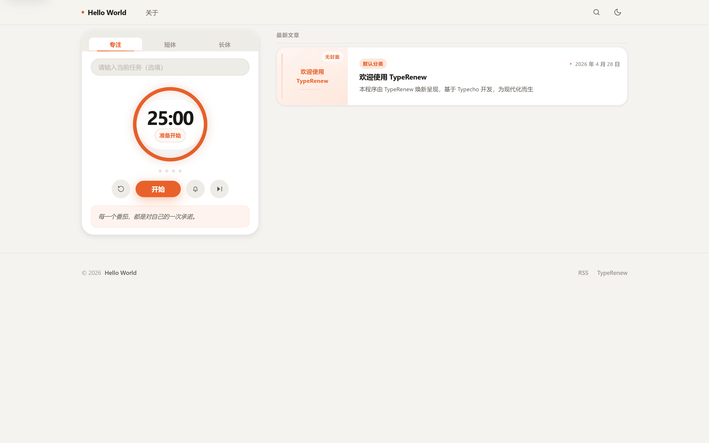

# PomeloFlow

【支持 TypeRenew】一款自带番茄钟功能的简约博客主题，内置迷你音乐播放器与专注提示（一言 API 可选），适配 PHP 8

## 预览

- 在线预览：https://blog.yangsh888.com/



## 特性

- **原生适配 TypeRenew** - TypeRenew 是基于 Typecho 所开发的现代化 CMS 程序，详见：https://github.com/Yangsh888/TypeRenew
- **番茄钟** - 专注/短休/长休，支持自动开始下一阶段，文章页支持悬浮快捷入口
- **专注提示** - 内置提示文案 + 一言 API（可选）自动刷新
- **背景音乐播放器** - 支持直链音频（MP3/OGG 等）与网易云歌曲 ID（需自部署 API）
- **深浅色外观** - 跟随系统 / 浅色 / 深色
- **文章阅读增强** - 阅读进度条、文章目录、代码一键复制、图片灯箱预览
- **评论体验优化** - 楼中楼展示、快捷回复、表单交互增强
- **友情链接页面** - 卡片式友链页面 + 可选全局页脚友链
- **安全加固** - URL 校验、输出转义、CSRF Token、防止不安全协议注入
- **响应式设计** - 适配手机/平板/桌面端

## 安装

1. 下载主题源码（Release / 直接下载 / Git Clone）。
2. 进入站点 `/usr/themes/` 目录。
3. 将主题文件夹 `PomeloFlow/` 上传至 `/usr/themes/`（最终路径形如：`/usr/themes/PomeloFlow`）。
4. 登录后台，进入「控制台 → 外观」，启用主题。
5. 进入「外观 → 设置外观」配置主题选项。

## 配置项

在「外观 → 设置外观」中可配置：

- 站点 Logo 地址
- Favicon 地址
- 一句话自我介绍
- 备案号
- 外观风格（跟随系统 / 浅色 / 深色）
- 翻页模式（数字翻页 / 加载更多）
- 文章默认封面图库（当文章无封面且正文无图时随机取图）
- 版权声明（文章底部 CC 声明）
- 作者介绍卡片（文章底部 About 作者）
- 番茄钟功能开关
- 专注/短休/长休时长与长休触发间隔
- 自动开始下一阶段
- 背景音乐播放器开关
- 专注提示加载策略（本地优先 / API 优先）
- 音乐列表（直链或网易云 ID）
- 网易云音乐 API 地址（可选）
- 社交媒体链接（用于页脚与作者卡片）
- 全局页脚友链开关与展示数量
- 友情链接数据池（用于友链页面与全局页脚友链）

## 文章字段

在编辑文章/页面时，可在「自定义字段」配置：

- `articleDesc`：文章摘要（列表展示，留空自动截取正文）
- `bannerUrl`：文章封面图（列表封面 + 文章页顶部 Banner）
- `directoryOn`：文章目录（auto/on/off）
- `pomodoroHide`：文章页隐藏番茄钟悬浮按钮（true/false）

## 友情链接页面

1. 在主题设置中填写「友情链接数据池」，格式：`名称||网址||简介||头像URL`（头像可留空）。
2. 新建独立页面，并在模板中选择「友情链接」。
3. 如需全站底部展示纯文本友链，开启「全局页脚友链」并设置显示数量。

## 目录结构

```
PomeloFlow/
├── libs/           # 核心函数库
├── public/         # 公共模板组件
├── component/      # 页面组件
├── assets/         # 静态资源
│   ├── css/
│   ├── js/
│   └── img/
├── screenshot.png  # 主题截图
└── functions.php   # 主题配置与字段
```

## 技术栈

- PHP 8.0+
- MySQL / PostgreSQL / SQLite
- 原生 ES Modules（按需动态加载）
- HTML5 Audio（音乐播放）

## 开源许可协议

本项目基于 GNU General Public License 2.0 协议开源。

核心条款：

- 可以自由使用、修改、分发本软件
- 分发时必须保留原始版权声明和许可证
- 修改后的版本必须以相同协议开源
- 不提供任何担保，作者不承担使用本软件产生的任何责任

完整协议文本见 [LICENSE](LICENSE) 文件或访问 [GNU GPL 2.0](https://www.gnu.org/licenses/old-licenses/gpl-2.0.html)。
